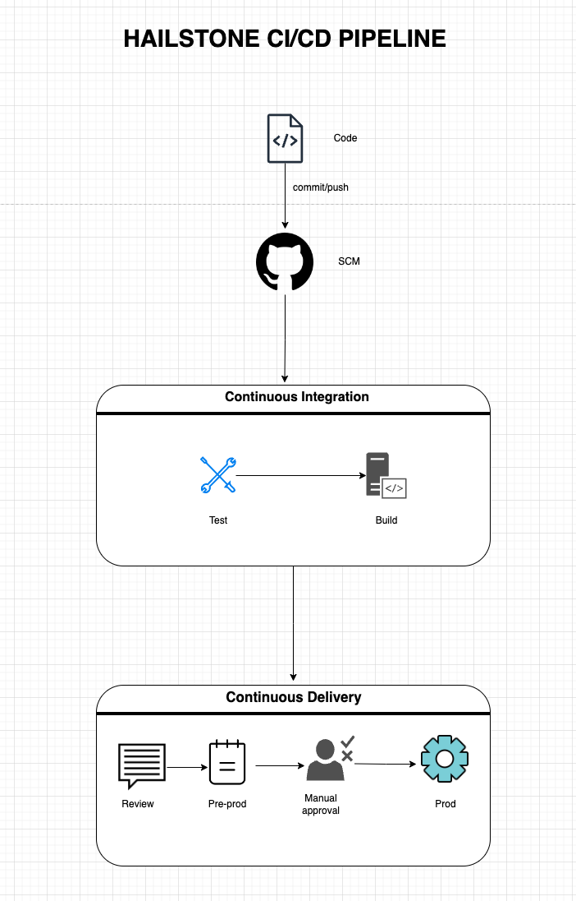

# Architecture Documentation

This document provides an overview of the architecture of the Hailstone Calculator project.

## Overview

The project consists of the following components:

- **HailstoneCalculator Class:** Python class responsible for calculating Hailstone sequences.
- **Dockerfile:** Defines the Docker image for the Hailstone Calculator application.
- **AWS Lambda Function:** Serverless function for executing Hailstone calculations.
- **Azure Function:** Serverless function for executing Hailstone calculations.

## File Structure

- **docs/:** Includes the documnetations for the project.
- **infra/:** Includes the cloud infrastructure and provisioning.
- **notebooks/:** Includes notebooks for research implementation.
- **requirements/:** Includes reuirements for linting, testing and production.
- **src/:** Contains the source code for the HailstoneCalculator class.
- **test/:** Includes test for the HailstoneCalculator.
- **Dockerfile:** Specifies the Docker image configuration.

## Dependencies

- Python 3.10
- AWS CLI for deployment
- Docker for containerization
- Additional dependencies listed in requirements.txt

## Workflow

The typical workflow involves building the Docker image, running the application locally, and deploying the AWS Lambda function.

