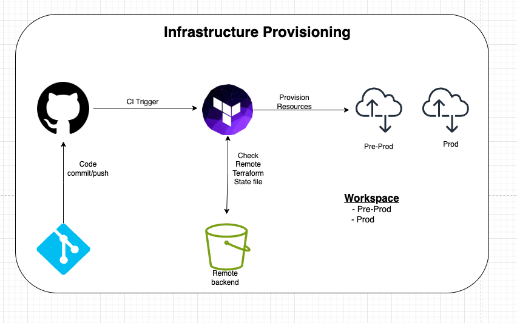

# Deployment Instructions

This document provides instructions for deploying the Hailstone Calculator project.

## Environment Setup


Environment Configuration

The project relies on environment variables configured in the .env file.

AWS_REGION=<your_aws_region>
AWS_ACCOUNT_ID=<your_aws_account_id>
AWS_ECR_REPO_NAME=<your_ecr_repository_name>
Ensure these variables are set before running deployment scripts.


## Local Development

For static code analysis and auto-formatting code:

```bash
make lint_all
```


For testing code:

```bash
make test
```

To run the application locally, build the Docker image and execute the container:

```bash
make run
```


## AWS Lambda Deployment

Deploy the Hailstone Calculator AWS Lambda function using the following commands:

```bash
make build_push
```

This will build the Docker image and push it to Amazon ECR

For deploying infrastructure using Terraform, follow these steps:

Create an s3 bucket and dynamodb for remote backend

```bash
make terraform_init

make terraform_plan

make terraform_apply
```




### CI/CD Pipeline

The project includes a GitHub Actions workflow for 

- linting
- testing
- publishing to a private pypi repository 
- build docker image and push to docker repository 
- deploying to aws lambda using terraform
